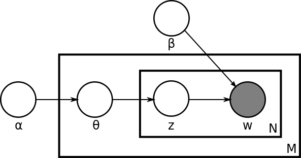

# LDA explained

LDA stands for *Latent Dirichelet Allocation*.
It is a generative probabilistic model that is used in natural language processing.

## LDA Principle
LDA is a generative model, meaning its first function is to randomly generate observable results, for example to simulate values of a model.
By using the mathematical model, we can go "backwards" and take real life measures to find a corresponding model that generates it best.

That's what we're doing here, using words from Wikipedia articles as observations (called 'Documents'), and trying to group these words and documents into topics.

This image represents the construction of an LDA model visually by using its parameters :

Source : [https://commons.wikimedia.org/wiki/File:Latent_Dirichlet_allocation.svg](https://commons.wikimedia.org/wiki/File:Latent_Dirichlet_allocation.svg)

*α*, *β* are explained in the next paragraph. *M* represents all documents of the corpus, *N* represents the words within a particular document. **

## LDA Parameters
LDA uses some values that should be changed in order to fit to the chosen situation.
Here they are :

- **K**, which is `k` in our code. Represents the number of topics.
- **V**, which is `` in our code. Represents the vocabulary size.
- **M**, which is `1520` in our executions. Represents the total number of documents.
- **α**, which is `alpha` in our code. Parameter of the Dirichelet prior, that represents the concentration of expected topics per document.
- **β**, which is `beta` in out code. Parameter of the Dirichelet prior, that represents the concentration of expected words per topic.

## Our usage
In our case we'll use it to retrieve concepts from Wikipedia articles.
That means we'll be using the model not by generating documents, but rather by analysing the collection we have and try to infer what are the common topics of a set of them.
We'll then try to show interesting statistics about the topics we found.